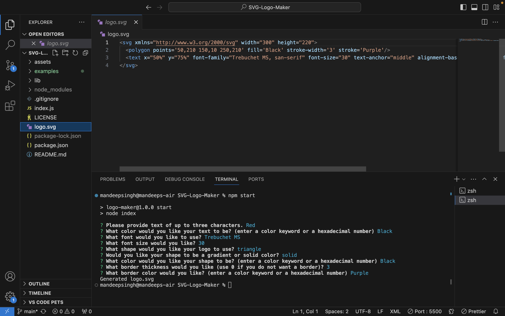

# SVG Logo Maker Application

## Description

This command-line application lets you create custom logos by specifying text, color, and shape. It generates SVG files based on your input, allowing you to visualize and save your logo designs.

## Features

- Input up to three characters for text.
- Choose from circle, triangle, or square shapes.
- Specify text and shape colors using color keywords or hexadecimal codes.
- Outputs SVG files named `logo.svg`.

## Usage

1. Run the application using `node index`.
2. Follow the prompts to enter text, select a shape, and choose colors.
3. Once done, find your logo as `logo.svg` in the project directory.
4. Open `logo.svg` in a web browser to view your logo.

## Installation

1. Clone or download this repository.
2. Navigate to the project directory.
3. Install dependencies with `npm install`.

## License

This project is licensed under the MIT License - see the [LICENSE.md](LICENSE.md) file for details.

## Screenshot

## Copyright
&copy; 2024 Mandeep Singh | [mandeepiscoding](https://github.com/mandeepiscoding)

